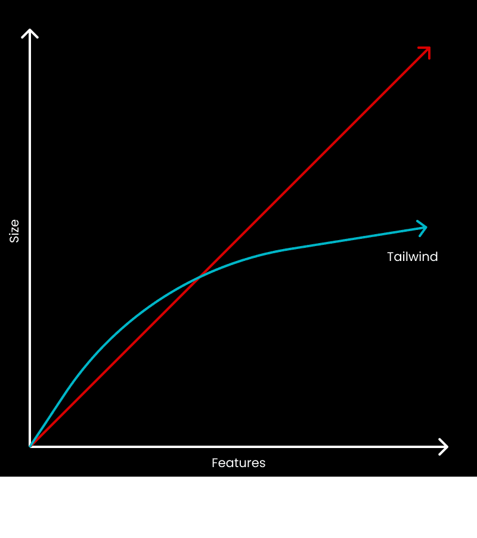

# Tailwind CSS

[Tailwind](https://tailwindcss.com) is the CSS framework of choice for
Silverback. We chose Tailwind because it's the most promising utility-first
framework currently available. Tailwind act as a low-level framework which gives
you building blocks to design in a fast way.

## Utility first

Utility first means that you don't have to write CSS or SCSS, you only need to
add pre-defined classes to HTML elements. While writing pure CSS is very good
for a beginner to fully understand rules and properties, it's hard to scale for
complex designs.

With SCSS, you often end up with a lot of folders, files, class names, mixins
and functions. Maintaining such a structure and trying to keep it DRY costs a
lot in terms of business hours. How much time have you spent trying to figure
out a good class name for a component's element?

Here comes the utility first approach: a pre-defined CSS stylesheet that
contains classes that do only one specific thing:

```css
.flex {
  display: flex;
}

.p-6 {
  padding: 1.5rem;
}
```

You may think: "What about the final size of the CSS? It will be huge!". You're
wrong! Tailwind CSS pairs with PostCSS purge feature, so you'll end up with only
the classes you are currently using. Furthermore, utility classes are shared
between elements, and the file size will remain constant upon adding new
features.

<p className="text-center text-xs">
  Image courtesy of&nbsp;
  <a href="https://dev.to/joserfelix/why-use-tailwind-css-for-your-next-project-39hp">
    Jose Felix
  </a>
</p>



## Shallow learning curve

Reading a component's source code that contains Tailwind classes is as easy as
reading single CSS properties:

```html
<div class="bg-white rounded shadow border p-6">
  <h5 class="text-3xl font-bold mb-0 mt-0">Lorem ipsum</h5>
  <h6 class="text-xl mb-4 mt-0">
    Lorem ipsum dolor sit amet, consectetur adipiscing elit.
  </h6>
  <p class="text-gray-700 text-sm mb-2">
    Lorem ipsum dolor sit amet, consectetur adipiscing elit. Donec condimentum,
    quam nec sodales commodo, mauris ante finibus justo, non eleifend eros lacus
    blandit leo. Donec tincidunt luctus blandit. Nulla euismod eleifend
    placerat.
  </p>
  <button
    type="button"
    class="inline-flex items-center px-6 py-3 text-base font-medium rounded-md shadow-sm text-white bg-indigo-600 hover:bg-indigo-700"
  >
    Bursas resistere!
  </button>
</div>
```

I bet you already know what will be the final appearance of that piece of HTML,
without even going back and forth between HTML and CSS source code. In case you
need some help, here's the rendered version.

<div class="bg-white rounded shadow border p-6">
  <h5 class="text-3xl font-bold mb-0 mt-0">Lorem ipsum</h5>
  <h6 class="text-xl mb-4 mt-0">
    Lorem ipsum dolor sit amet, consectetur adipiscing elit.
  </h6>
  <p class="text-gray-700 text-sm mb-2">
    Lorem ipsum dolor sit amet, consectetur adipiscing elit. Donec condimentum,
    quam nec sodales commodo, mauris ante finibus justo, non eleifend eros lacus
    blandit leo. Donec tincidunt luctus blandit. Nulla euismod eleifend
    placerat.
  </p>
  <button
    type="button"
    class="inline-flex items-center px-6 py-3 text-base font-medium rounded-md shadow-sm text-white bg-indigo-600 hover:bg-indigo-700"
  >
    Bursas resistere!
  </button>
</div>

Furthermore, Tailwind documentation is well written and covers every aspect you
need. The community is constantly growing, with a lot of plugins and
integrations.

## Component driven

Tailwind helps you with component driven design. When you find out you're
repeating the same utilities over and over again, you only have to extract them
into a component or a template. This way you'll achieve a single source of truth
and increase maintainability.

```jsx
const CardTitle = ({ children }) => (
  <h5 className="text-3xl font-bold mb-0 mt-0">{children}</h5>
);

const CardSubtitle = ({ children }) => (
  <h6 className="text-xl mb-4 mt-0">{children}</h6>
);

const CardContent = ({ children }) => (
  <p class="text-gray-700 text-sm mb-2">{children}</p>
);

const CardButton = ({ children }) => (
  <button
    type="button"
    className="inline-flex items-center px-6 py-3 text-base font-medium rounded-md shadow-sm text-white bg-indigo-600 hover:bg-indigo-700"
  >
    {children}
  </button>
);

const Card = ({ children }) => (
  <div className="bg-white rounded shadow border p-6">
    <CardTitle>Lorem ipsum</CardTitle>
    <CardSubtitle>
      Lorem ipsum dolor sit amet, consectetur adipiscing elit.
    </CardSubtitle>
    <CardContent>{children}</CardContent>
    <CardButton>Bursas resistere!</CardButton>
  </div>
);
```

## Customization

Tailwind is not a closed box: it comes with predefined colors, sizings and
typography, but they can all be fully customized by simply editing its
configuration file:

```js
module.exports = {
  theme: {
    colors: {
      amazee: {
        yellow: '#ffcc4f',
        gray: '#64675E',
        dark: '#2c3539',
        blue: '#60839b',
      },
      gray: {
        100: '#f0f0f0',
        200: '#ccc',
        300: '#aaa',
      },
    },
  },
};
```

<div className="w-full grid grid-flow-row grid-cols-7 grid-rows-2 text-xs">
  <div className="h-7 bg-amazee-yellow" />
  <div className="h-7 bg-amazee-gray" />
  <div className="h-7 bg-amazee-dark" />
  <div className="h-7 bg-amazee-blue" />
  <div className="h-7 bg-gray-100" />
  <div className="h-7 bg-gray-200" />
  <div className="h-7 bg-gray-300" />
  <div className="inline-flex items-center justify-center">
    bg-amazee-yellow
  </div>
  <div className="inline-flex items-center justify-center">bg-amazee-gray</div>
  <div className="inline-flex items-center justify-center">bg-amazee-dark</div>
  <div className="inline-flex items-center justify-center">bg-amazee-blue</div>
  <div className="inline-flex items-center justify-center">bg-gray-100</div>
  <div className="inline-flex items-center justify-center">bg-gray-200</div>
  <div className="inline-flex items-center justify-center">bg-gray-300</div>
</div>

You can also create custom Tailwind plugins to extend the basic functionalities,
or add PostCSS plugins (`autoprefixer` for example) to increase the power of
your design library.

## Why not styled-components or twin.macro

While `styled-components` and `twin.macro` are great alternatives to Tailwind,
but they also have downsides that won't make them a good fit for Silverback:

- Using `css-in-js` blocks the rendering process of the browser or produces FOUC
  (unless you work around it by statically generating the stylesheet during
  build time).
- Adding another layer of libraries goes against our goal of having our own
  design library with fewer dependencies possible.
- Most of the time, Tailwind bundle size is smaller than the other solutions.
- Tailwind produces only a single file for the entire site, leveraging browser
  cache to its maximum.
- Tailwind is not bound to Javascript, it can be used to progressively migrate
  websites which make use of other rendering engines (`twig` or `blade` for
  example)

You can find a comparison between Tailwind and `twin.macro`
[here](https://github.com/AmazeeLabs/twin-playground).
