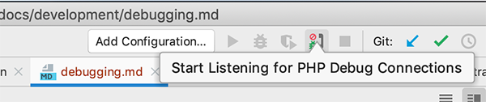
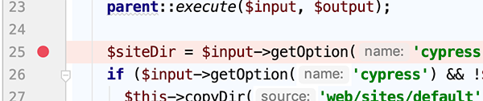
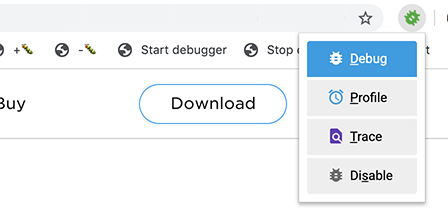

# Debugging

**Xdebug** is a great tool for PHP to step debug. Unfortunately it slows down PHP by around 20-25%. For tests and `drush` commands, it can be even slower.

To mitigate this problem for web browser requests, Amazee.io inspects the parameters and cookies of your request and if it finds the string `xdebug`, it automatically forwards the request to a PHP process which has Xdebug enabled.

These instructions describe using PHPStorm as the code editor for debugging. To use Visual Studio Code, you will need to install the [PHP Debug Adapter](https://marketplace.visualstudio.com/items?itemName=felixfbecker.php-debug). @TODO: Add [docs for how to configure VSC](https://github.com/AmazeeLabs/silverback/blob/master/docs/development/debugging.md) to work with Amazee.io docker containers.

## Debugging PHP or Twig files

You will need to setup your browser so that it triggers an Xdebug session. This can be done with bookmarklets or with a browser extension. This only needs to be installed once per browser.

* Bookmarklets (works with any browser): https://www.jetbrains.com/phpstorm/marklets/
* Chrome extension: [Xdebug Helper](https://chrome.google.com/webstore/search/xdebug)
* Firefox add-on: [Xdebug Helper](https://addons.mozilla.org/en-US/firefox/addon/xdebug-helper-for-firefox/)

**Note on Twig debugging:** Twig debugging won't work on old Silverback sites. Ensure `sites/default/amazeeio.development.services.yml` file has `parameters: twig.config: cache` set to `true`. If it is set to `false`, you can safely commit the change to your git repository.

**Note on Windows debugging:** If you are using Windows, you will first need to install some software. See the section below on [Debugging on Windows 10](#debugging-on-windows-10).

### At the start of your debugging session…

1. Restart the docker container to turn on Xdebug connections.
   1. In the Silverback project root directory, edit the `docker-compose.yml` file. Edit the following line to remove the `#` comment character from its beginning:
      ```yaml
      XDEBUG_ENABLE: "true"
      ```
   2. Restart the local docker container with:
      ```shell script
      docker-compose up -d`
      ```
2. Setup PHPStorm to debug your file.
   1. In the top-right palette of icons in your PHPStorm window, click the “Start Listening for PHP Debug Connections” button. Or select that option from PHPStorm’s “Run” pull-down menu.

      
   2. At the line of code you'd like to examine, look in the left gutter and click to the right of the line number to add a breakpoint for this line. A red dot will appear to indicate a breakpoint has been set.

      

3. Trigger the debugging with your web browser.
   1. Open your web browser to the web page you want to debug.
   2. Turn on Xdebug with your browser extension or bookmarklet. Either click on the bookmarklet to run its JavaScript code or click on the browser extension's buttons.

      

   3. Reload the page to begin the debugging session.
   4. **When debugging Twig files**, you will need to reload the page one extra time. The first time the page loads after your change, Twig will compile the `.twig` template to a PHP file which it will save in its cache at the end of the first reload. On the second reload, PHPStorm will be able to debug your `.twig` template using the cached PHP file in the background.

### At the end of your debugging session…

If you fail to turn off debugging, you will notice `drush` commands being extremely slow.

1. In the top-right palette of icons in your PHPStorm window, click the “Stop Listening for PHP Debug Connections” button. Or select that option from PHPStorm’s “Run” pull-down menu.

      

2. Stop triggering a debug session on your web browser, by doing one of the following:
   * Turn off Xdebug with your browser extension or bookmarklet. Either click on the “stop debugger” bookmarklet or click on the browser extension's buttons.

      

   * Or, just close the browser window with the web page you were debugging.

3. The previous two steps should be sufficient. Optionally, restart the docker container to turn off Xdebug connections.
   1. In the Silverback project root directory, edit the `docker-compose.yml` file. Edit the following line to add the `#` comment character to its beginning:
      ```yaml
      #XDEBUG_ENABLE: "true"
      ```
   2. Restart the local docker container with:
      ```shell script
      docker-compose up -d`
      ```

## Debugging Tests

@TODO

## Debugging on Windows 10

Before you can debug on Windows 10, you will need to install and configure a loopback adapter.

1. Install a Loopback adapter.
   1. Click Start, then type `cmd` in the search box.
   2. When `cmd.exe` appears, right-click and choose Run as administrator.
   3. In the command prompt, type `hdwwiz.exe` and press `Enter`.
   4. Click Next.
   5. Select `Install the hardware that I manually select from a list (Advanced)`, then click Next.
   6. Select `Network adapters`, then click Next.
   7. Select `Microsoft` as the manufacturer, select `Microsoft KM-TEST Loopback Adapter` as the adapter for Windows 10, then click Next.
   8. Select Next to confirm the installation.
   9. Select Finish to complete the installation.
2. Configure the loopback adapter.
   1. Click `Start > Settings > Network & Internet > Wi-Fi`.
   2. Under `related settings`, click `change adapter options`.
   3. Select the newly created connection.
   4. Right-click on the selected connection and choose `Properties` from the menu.
   5. Confirm that `Microsoft Loopback Adapter` or `Microsoft Loopback Adapter #` is displayed in the `Connect Using:` field. If it is not, retry properties for another adapter.
   6. Deselect everything except `Internet Protocol 4 (TCP/IPv4)`.
   7. Select `Internet Protocol 4 (TCP/IPv4)`, and click `Properties` to open `Internet Protocol 4 (TCP/IPv4)` Properties.
   8. Select `Use the following IP address`. Fill in the IP address and Subnet mask with the following:
      ```
      IP address: 172.16.172.16
      Subnet mask: 255.255.255.0
      ```
   9. Click `Advanced` to open `Advanced TCP/IP Settings`.
   10. Switch to the `WINS` tab and select `Disable NetBIOS over TCP/IP`.
   11. Click OK to close `Advanced TCP/IP` Settings.
   12. Click OK to close the `Internet Protocol (TCP/IP)` Properties.
   13. Click OK to close the connection properties.
3. Follow the instructions above under [Debugging PHP or Twig files](#debugging-php-or-twig-files).
