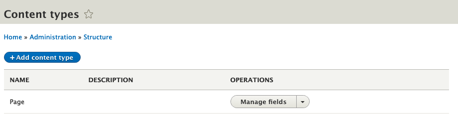
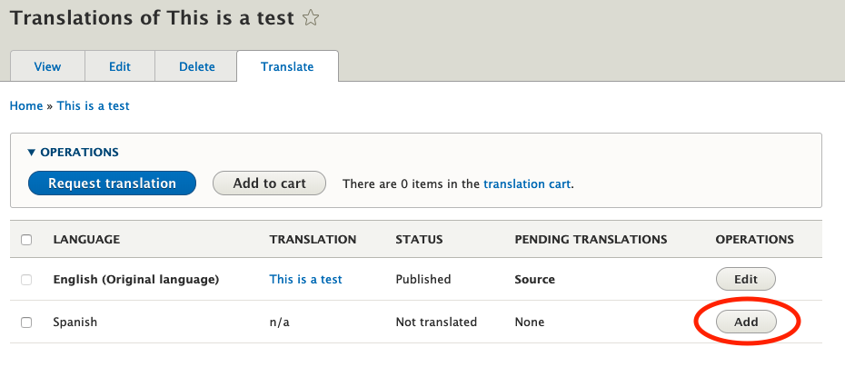
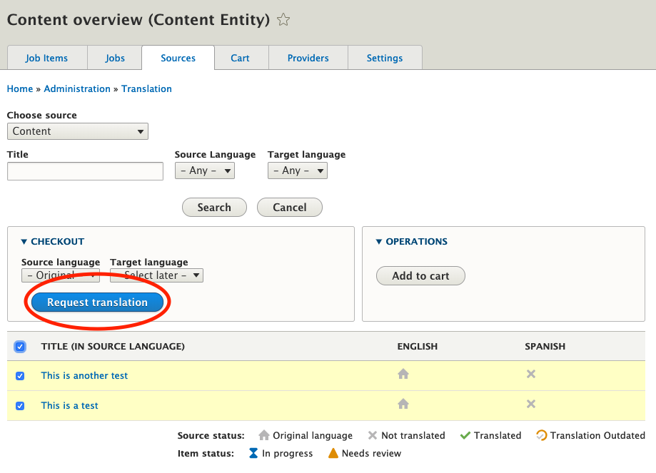

# Language Management

## Add language

To add a language to your site, go to the [languages config page](http://127.0.0.1:8888/admin/config/regional/language) 
at `Configuration -> Regional and Language -> Language` and click `Add language`. 

## Enable node content translation

Drupal requires content to be translated per content type. Since Silverback doesn't come with any content types out the 
box, the first step is to [add your required content types](http://127.0.0.1:8888/admin/structure/types) at `Structure 
-> Content Types`.

Once you have content types to translate, you can configure their translation settings on the 
[content language page](http://127.0.0.1:8888/admin/config/regional/content-language) at `Configuration -> Regional and 
Language -> Content language and translation`.

## Manually translate content

After these settings have been configured to your needs, you will be able to manually add translations of the 
configured nodes.

## Request content translations

Drupal supports translation requests using XLIFF files that can be imported and exported via the UI. This can be done 
for a single piece of content using the above described method. However, the most sensible approach with multiple pieces
of content is to use the [content sources](http://127.0.0.1:8888/admin/tmgmt/sources) page at `Translation -> Sources` 
and request a translation.
 

Ensure you choose `File exchange` as the provider and export the file to XLIFF.
 

You can then export the file which can be used to translate the content as necessary.
 

Once the file has been updated with the necessary translations, the file can be re-uploaded to the translation job.
 

