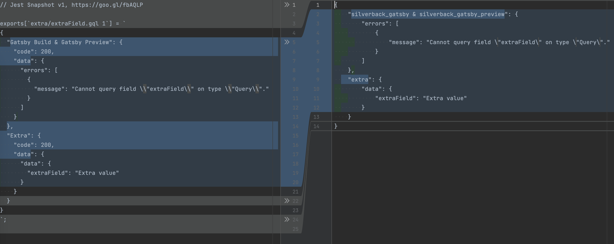

# ⚠️ DEPRECATED

We compared this module with
[@amazeelabs/graphql-schema-test](https://www.npmjs.com/package/@amazeelabs/graphql-schema-test)
and found no reason to use it:

- there was a lot of headache with the Domain module
- tests ran with `@amazeelabs/graphql-schema-test` take almost same time

# Drupal GraphQL Snapshot Testing

A Drush command that runs GraphQL queries against configured GraphQL servers and
stores the results in snapshots.

## Installation

```shell
composer require --dev amazeelabs/graphql_snapshot_test
```

## Usage

```shell
drush help graphql:snapshot:test
```

Results can be altered from custom modules. See
[graphql_snapshot_test.api.php](graphql_snapshot_test.api.php)

## Migration from `@amazeelabs/graphql-schema-test`

The package is designed to replace `@amazeelabs/graphql-schema-test` with
minimum effort. But you'll have to rewrite all your masking code to PHP 😬

New snapshots should look very close to the old ones. Example:



Tip: Use `--servers` option if the servers execution order does not match to the
old one.
