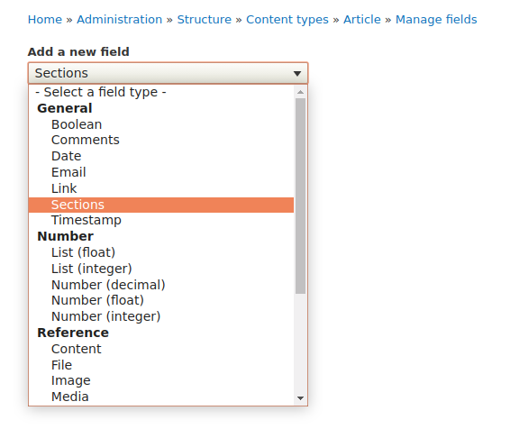
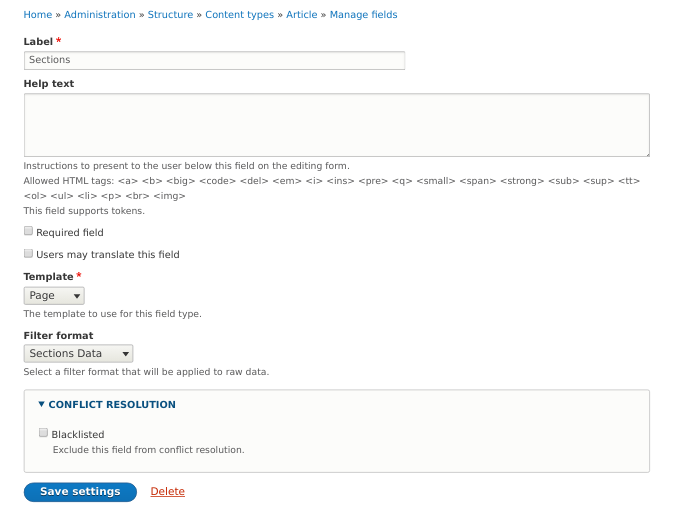
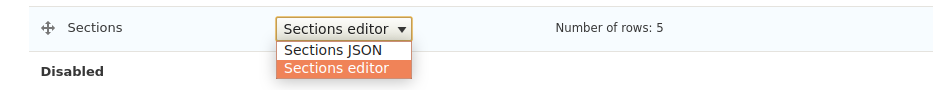
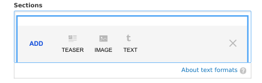
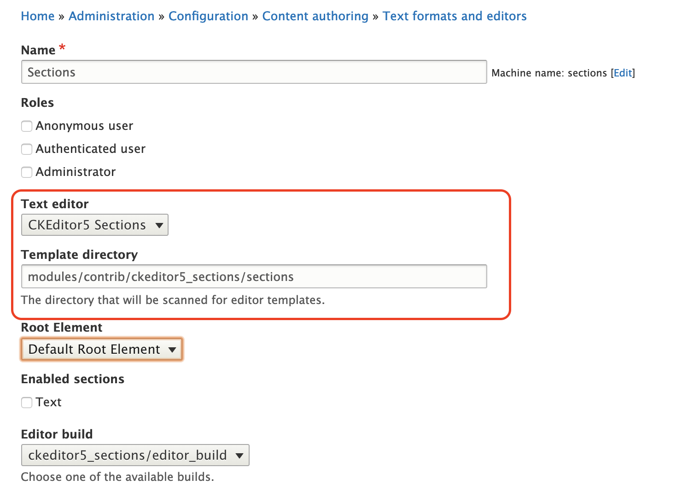
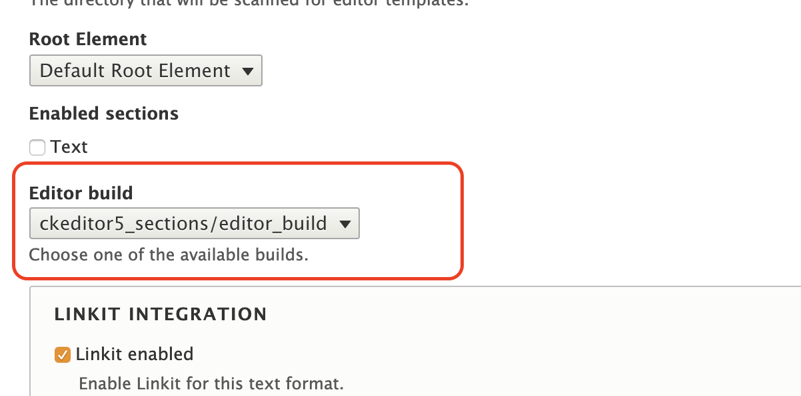
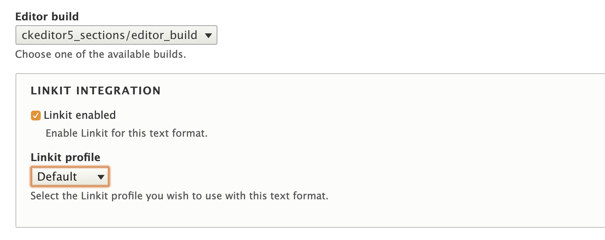
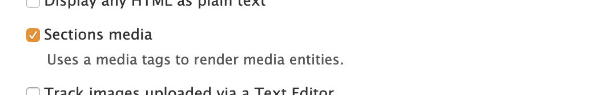

# Sections editor

## Preface

The [CKEditor5 Sections module] for Drupal allows to create custom WYSIWYG
interfaces for complex document structures by composing simple html templates.

[CKEditor5 Sections module]: https://www.drupal.org/project/ckeditor5_sections

## Installation

After enabling the module you have to a new field of type `Sections` to a content type.



Choose a field cardinality and proceed to configure the field to use e.g. "Page"-template a root element.

Please make sure to select the `Sections Data` as filter format as the pre-defined `sections_data`-filter is the *only
allowed* input format and cannot be configured at the moment.



The editor for this field will use the template as its *"Root element"*. This template can still have sub-templates
(more about that in the section [containers](#containers)), but it is useful if you have to maintain strict control
over the document structure, like for a landing page layout.

Proceed then to configure the form display mode to use `Sections editor`.



When adding a new piece of content the Sections field should look like this after clicking on "ADD":

.

## Input filter and editor configuration

The pre-defined input filter for sections can be found at `admin/config/content/formats/manage/sections_data`.

### Template directory
The editor will scan a directory for template definitions. By default this is
set to the `sections` directory packaged with the module. You can just create
a custom directory anywhere in your project and point the editor to it.




A template has to consist of a `.yml` and a `.html` file. The `.yml` contains
meta information about the template. Currently it's just the template label
and the icon to be displayed for inserting it into the document.

```yaml
label: Text
icon: text
```

The `.html` file contains the actual template data structure. This are standard
HTML elements along with some special attributes to trigger editor behavior. For
more on this read on further below.

### Editor build

The module comes with a pre-built version of the editor. It is also possible to
create a project specific build with custom plugins and behavior. This select
box allows to choose which build to use.



> TODO: Fix issues with local editor builds and finish this documentation.

### LinkIt integration

The [LinkIt](http://drupal.org/project/linkit) module is used to create links
within the editor and support the user choosing link destinations. The LinkIt
integration has to be enabled and a Linkit profile has to be available for this
to work.




### Media previews

To display media previews when directly outputting the editor content, the
*Sections media* output filter has to be enabled.



## Writing templates

An editor template can contain arbitrary HTML elements that will be used to
render the editing interface. The element structure of a template is locked.
Users can only edit parts that are marked with a `ck-type` attribute, which will
invoke a widget to modify the specific area.

### Text

```html
<div class="text">
  <h2 ck-type="text">Enter a headline ...</h2>
  <div class="text__content" ck-type="text">Enter some content ...</div>
</div>
```

This template will enforce a structure of a fixed `h2` headline and a free text
field. The `ck-type` attribute will make the editor apply a specific widget to
make this element editable.

If applied to a block element (`<p>`, `<h2>` ...), only inline editing is enabled.
On container elements (`<div>`, `<td>`, `<li>` ...) users can insert more block
level elements like lists, tables or quotes. When setting the `ck-plain` attribute
to `true` **all** formatting options are disabled and the element is treated as
plain text.

### Media

```html
<div ck-type="drupal-media" data-media-uuid=""
     data-media-type="image" data-media-display="editor"></div>
```

Allows to embed a Drupal media entity into the document. The `data-media-type`
attribute allows narrow down the list of allowed entities, while `data-media-display`
sets the entity display mode that is used for the in-editor preview.

### Button

```html
<div ck-type="button" link-target="" title="" target="" rel="">
  <div ck-type="text">Click me!</div>
</div>
```

Injects a dedicated button element (and in this case a nested text element for
the button text). This element will also display a inline link icon that will
bring up the [LinkIt] dialogue.

### Container

```html
<div ck-type="container" ck-contains="text image quote"></div>
```

This renders an element that allows to add an arbitrary number of `text`, `image`
or `quote` templates and reorder them.

### Gallery

```html
<div ck-type="gallery" ck-contains="image"></div>
```

Renders a gallery that contains one specific item type and allows the user to add
an arbitrary number of slides.

### Tabs

```html
<div ck-type="tabs" ck-contains="text"></div>
```

Renders a tabs that contains one specific item type and allows the user to add
an arbitrary number of tabs and add labels to them.


## Gotchas!

* Templates don't include styling. Stylesheets for the editor experience have
to be added by the project as a library.
* Don't use `ck-type` at a templates root element.
* Every element should have a distinct class to be recognised and processed
properly.

## WIP: Data binding

> At the time of writing, this section is a draft on how to implement proper two
way data binding. It's not available in the module yet.

An editor template can be annotated with microdata attributes `itemtype` and
`itemprop`. Using this information the engine is able to extract structured data
from a document created with the editor.

The following rules apply:

* If an element has an `itemtype` attribute, it is treated like an object.
  * The typename will be extracted to the `__type` property.
  * The HTML content will be extracted to the `__content` property.
  ***TODO:** This doesn't have to happen for each element. Define a sensible
  rule for that.*
  * All attributes except `class` and `data-` are copied over to the result.
  * `data-*` attributes are converted according to [HTML datasets].
* If an element has an `itemprop` attribute, it will be attached to the parent
with the defined property name.
  * If the element has *no* `itemtype` attribute, the elements html content
  is used as the result value.
  * If the element *does* have an `itemtype` attribute, the complex result
  object is used as the result value.

[HTML datasets]: https://developer.mozilla.org/en-US/docs/Web/API/HTMLElement/dataset

Example template

```html
<div class="teaser" itemtype="teaser" data-layout="">

  <div ck-type="drupal-media"
       data-media-type="image"
       itemprop="image"
       itemtype="image"
       class="teaser__image"
  ></div>

  <div class="teaser__content">

    <h2 ck-type="text"
        itemprop="headline"
        class="teaser__headline"
    >Headline placeholder</h2>

    <div ck-type="text"
         itemprop="text"
         class="teaser__text"
    >Teaser content placeholder
    </div>

    <a ck-type="button"
       itemtype="button"
       itemprop="link"
       class="teaser__link"
    >Link text placeholder</a>

  </div>
</div>
```
### Example document
```html
<div class="teaser" data-layout="image-left">
    <div class="teaser__image"
         data-media-uuid="123"
         data-media-type="image">
    </div>
    <div class="teaser__content">
        <h2 class="teaser__headline">Headline</h2>
        <div class="teaser__text">Teaser <em>content</em></h2>
        <a href="/node/1" class="teaser__link">Link text</a>
    </div>
</div>
```

### Example data
```yaml
__type: teaser
image:
  __type: image
  mediaType: image
  mediaUuid: 123
headline: Headline
text: Teaser <em>content</em>
link:
  __type: button
  href: /node/1
  __content: Link text
```

## Contributing

`amazeelabs/silverback` will by default pull the latest version of the module
from [drupal.org](http://www.drupal.org/project/ckeditor5_sections). If you
intend to contribute to the module and use the latest version you might want to
depend on the most recent build from [GitHub](http://github.com/AmazeeLabs/ckeditor5_sections) instead.

In this case you have to add a new repository to your projects `composer.json`:

```json
{
  "repositories": [
    {
      "type": "package",
      "package": {
        "name": "drupal/ckeditor5_sections",
        "version": "8.x-1.x-dev",
        "type": "drupal-module",
        "source": {
          "type": "git",
          "url": "https://github.com/AmazeeLabs/ckeditor5_sections.git",
          "reference": "8.x-1.x"
        }
      }
    }
  ]
}
```

And require it while *"pretending"* to use the latest stable to calm the gods of
version constraints:

```bash
composer require drupal/ckeditor5_sections:"8.x-1.x-dev as 1.0"
```

See [Composer documentation](https://getcomposer.org/doc/articles/aliases.md#require-inline-alias) for more information on using aliases.

### CKEditor5 packages

Apart from the packages provided by CKSource, this module uses three packages
maintained by Amazee Labs:

* **[@amazeelabs/ckeditor5-template](http://github.com/Amazeelabs/ckeditor5-template)**: Templating mechanisms, containers and
overall editor logic.
* **[@amazeelabs/ckeditor5-drupal-linkit](http://github.com/Amazeelabs/ckeditor5-drupal-linkit)**: Integration with the [LinkIt](http://drupal.org/project/linkit) module.
* **[@amazeelabs/ckeditor5-drupal-media](http://github.com/Amazeelabs/ckeditor5-drupal-media)**: For embedding media entities in documents.

To work on these packages, please head over to the forked [ckeditor5](http://github.com/AmazeeLabs/ckeditor5) repository. Information how to use it can be obtained from the [official documentation](https://ckeditor.com/docs/ckeditor5/latest/framework/guides/contributing/development-environment.html). For a general introduction to CKEditor5 development have a look at the [plugin development guide](https://ckeditor.com/docs/ckeditor5/latest/framework/guides/quick-start.html).

### Custom components

The editor also uses a set of custom web components, that are maintained in a
[separate repository](http://github.com/AmazeeLabs/editor-components). They are
built upon the [LitElement](https://lit-element.polymer-project.org/) framework.

The repository also contains a storybook setup to showcase and test all components.
Run `yarn run storybook` and you are ready to go.

### Building the editor

After updating any of the packages above, they have to be pulled into the
`ckeditor5_sections` module. To do that, navigate into the `editor` directory of
the module and run `yarn upgrade-packages`. After that, the editor can be rebuilt
using `yarn build`. The compiled assets should be committed to the module to make
them available on install.

