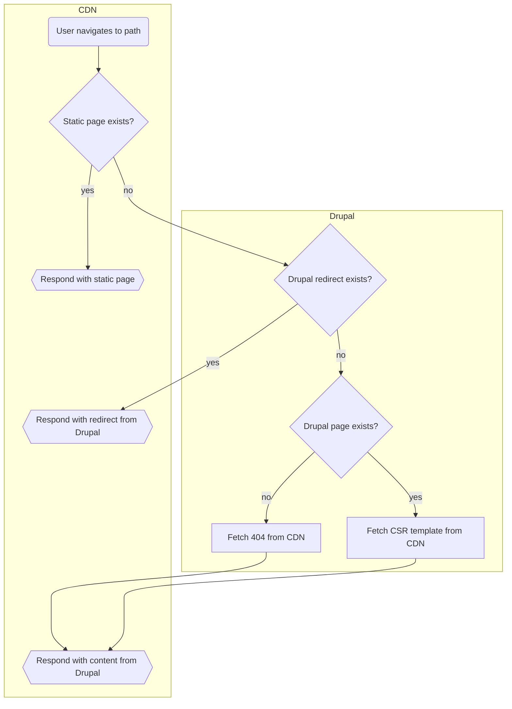

# Silverback CDN Redirect

To be used with static websites, hosted on a CDN (e.g. Gatsby and Netlify).
Solves two problems:

1. Can resolve redirects that are not stored in CDN config, which is necessary,
   since Drupal's redirect module creates a redirect for each path change,
   which can be a lot. In that case, the redirect is resolved by rewriting the
   request to Drupal.
2. Rewrite paths not know by the CDN, to client-side rendered pages. Useful for
   pages that should not be rendered statically.

## Flowchart!



## Drupal config

- Patch Drupal with a patch from
  [#2741939](https://www.drupal.org/project/drupal/issues/2741939)
- Enable the module
- Set the settings, for example:
  ```
  drush cset silverback_cdn_redirect.settings base_url https://my-gatsby.site
  drush cset silverback_cdn_redirect.settings 404_path /404
  drush cset silverback_cdn_redirect.settings should_prefix_404_path true
  ```

## Gatsby config

- Add
  [gatsby-plugin-netlify](https://www.gatsbyjs.com/plugins/gatsby-plugin-netlify)
  package
- Configure the catch-all redirect in `createPages`
  ```js
  createRedirect({
    fromPath: "/*",
    toPath: `https://my-drupal.site/cdn-redirect/:splat`,
    statusCode: 200,
  });
  ```
  Note: `statusCode: 200` is required to "hide" the request to backend from the
  browser.
