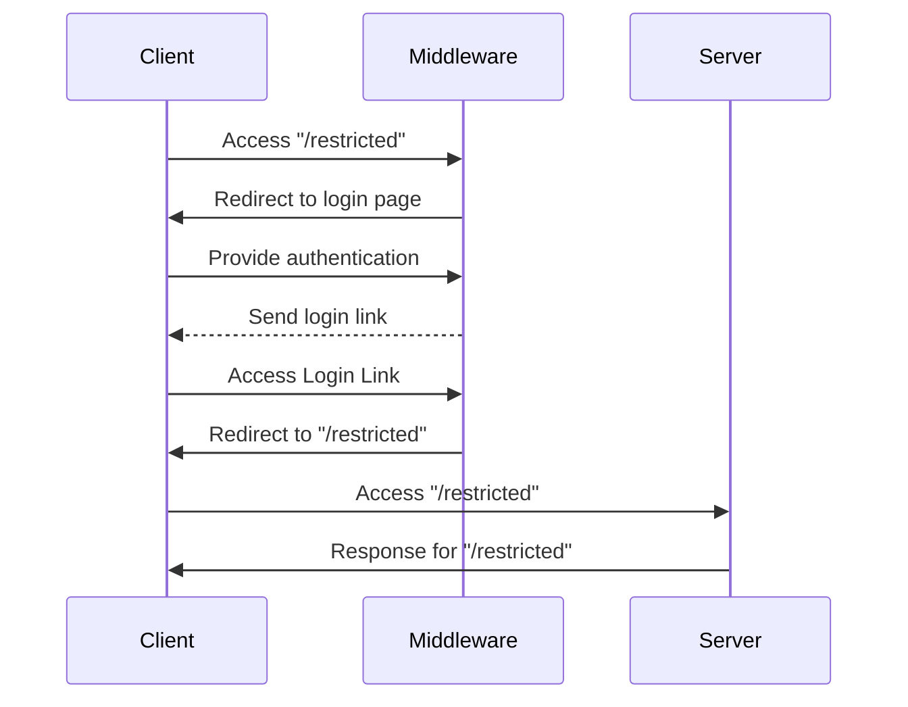

# Token Auth Middleware

This package provides a generic HTTP handler that can be used as middleware for
various Javascript based web servers. It does not rely on specific runtime
libraries like `crypto` and has been tested in Node and Deno environments.

The concept works as follows: The middleware has to be installed on a given
path, and will restrict access to it. Upon access, users will be prompted to
authenticate, using a third party message delivery (like e-mail). There they
receive a login link, which will grant them access to the resource.



## Usage

Create a Netlify edge and create an instance of an encoder, backend, and handler
(see more under "Extensibility").

```typescript
import {
  JwtEncoder,
  TestEmailBackend,
  TokenAuthHandler,
} from '@amazeelabs/token-auth-middleware';
import type { Context } from '@netlify/edge-functions';

const encoder = new JwtEncoder('shhhh, its a secret');

const backend = new TestEmailBackend({
  '*@amazeelabs.com': '*',
});

const handler = new TokenAuthHandler('/restricted', encoder, backend);

export default async (request: Request, context: Context) => {
  return handler.handle(request, context.next);
};
```

By default, the middleware does not need any deeper integration. It works purely
on HTTP. When accessing an restricted resource, the middleware will redirect to
a generic login form, which will prompt the user to authenticate. Then
middleware will then send a login link to the user, which will grant access to
the resource.

The package also includes a Javascript client that allows to implement this
process in a browser application.

```typescript
import { TokenAuthClient } from '@amazeelabs/token-auth-middleware';

const client = new TokenAuthClient('/restricted');

// Trigger submission of the login link.
await client.login('my@email.com');

try {
  // Access login status information.
  const status = await client.status();
} catch (e) {
  // User is not logged in.
}

// Log out again.
await client.logout();
```

## Extensibility

There are two ways to extend the middleware: The encoder and the backend.

### Encoders

The encoder is responsible for encoding and decoding the token. The provided
`JWTEncoder` uses the
[jrsasign](https://github.com/kjur/jsrsasign/wiki#programming-tutorial) library
to encode and decode tokens. The packages exposes an `TokenEncoderInterface`
that can be used to implement custom encoders, like one that uses platform
specific crypto libraries.

### Backends

Backends are responsible for identifying users and sending login links. The
packages provides a `PostmarkEmailBackend` which can use the postmark messaging
service to send login links. It inherits from the abstract `EmailBackend` class,
which can be used to implement email-based authentication with other services.

Email backends allow to restrict access to specific addresses and domains.

```typescript
import { PostmarkEmailBackend } from './email-backend';

const backend = new PostmarkEmailBackend(
  {
    // Allow everybody with an amazeelabs.com email address.
    '*@amazeelabs.com': '*',
    // Allow only a specific user.
    'my@email.com': 'Jane Doe',
  },
  '[POSTMARK_API_TOKEN]',
  'postmark-template',
);
```
